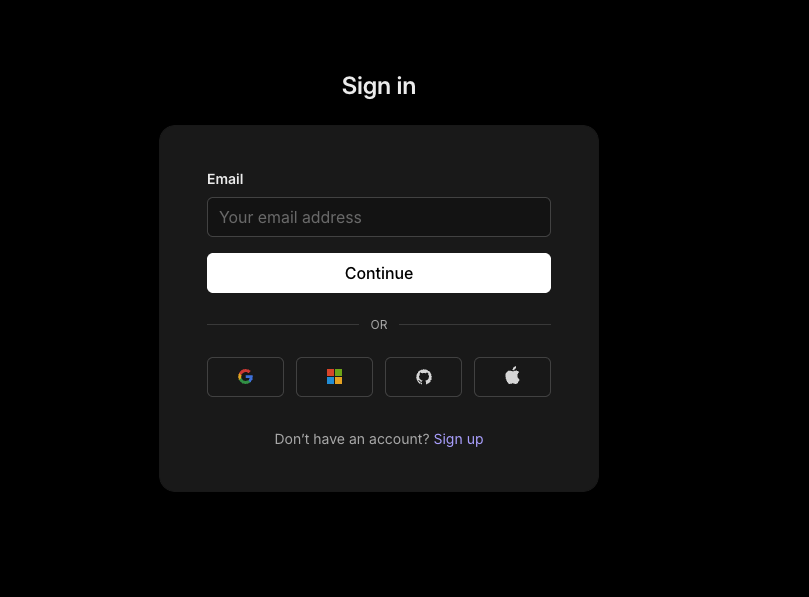
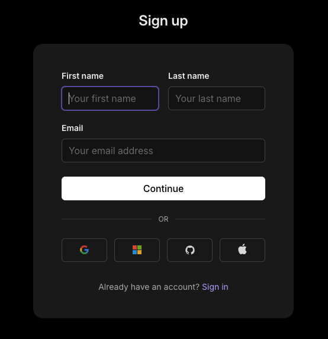
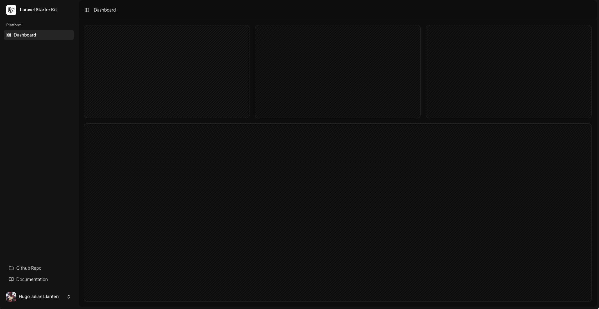
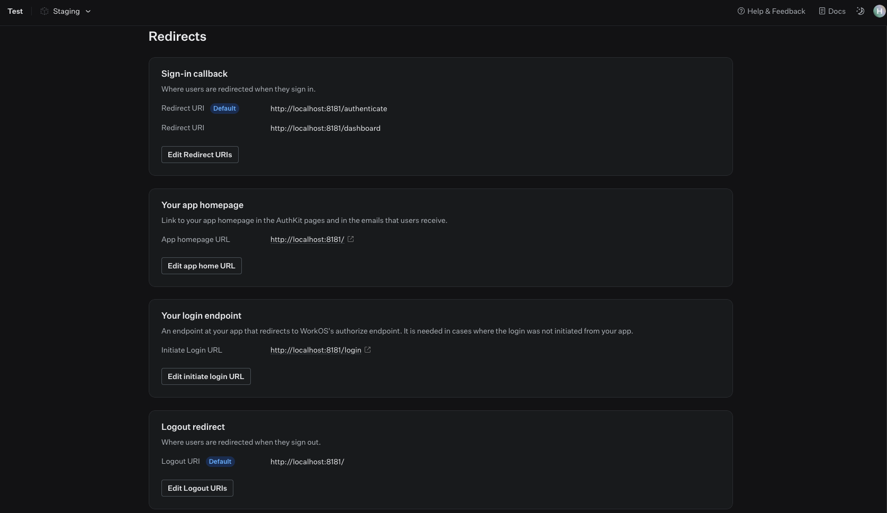

# Laravel 12 + WorkOS + Vue.js Starter Kit

## 📌 Descripción
Plantilla base para proyectos Laravel 12 con:
- Autenticación con WorkOS para SSO/SAML

<div align="center">
  <table>
    <tr>
      <td align="center">
        
        <p><b>Pantalla de Login</b></p>
      </td>
      <td align="center">
        
        <p><b>Pantalla de Registro</b></p>
      </td>
    </tr>
    <tr>
      <td align="center" colspan="2">
        
        <p><b>Pantalla de Dashboard</b></p>
      </td>
    </tr>
  </table>
</div>

- Frontend en Vue.js 3 (Composition API)

## 🚀 Requisitos Previos
- PHP 8.4+
- Composer 2.6+
- Node.js 20+
- Base de datos (MySQL/PostgreSQL)
- Cuenta en [WorkOS](https://workos.com)

## 🛠️ Instalación

### 1. Clonar repositorio
```bash
git clone https://github.com/tu-usuario/proyecto.git
cd proyecto
```

## 2. Instalar dependencias
```bash
composer install
npm install
```

### 3. Configurar WorkOS
- Crear una cuenta en [WorkOS](https://workos.com)
- Configurar un nuevo proyecto en el panel de WorkOS
<div align="center">
  
</div>

- Obtener las credenciales de API y el ID del cliente
```bash
WORKOS_KEY=tu_api_key
WORKOS_CLIENT_ID=tu_client_id
WORKOS_REDIRECT_URI="${APP_URL}/dashboard"
```

## 4. Configurar base de datos
```bash
# variables .env
DB_CONNECTION=mysql
### ...

# ejecutar migraciones
php artisan migrate
```

### 5. Iniciar servidor
```bash
php artisan serve
npm run dev
```


